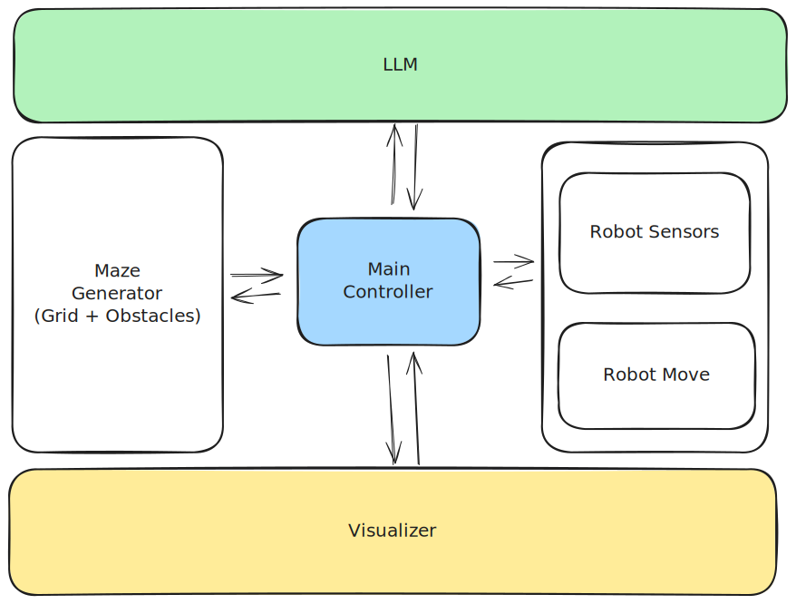

# MazeLLM
MazeLLM: Solving Mazes with Language Models

# Path Finding
<p align="center">
  <a href="https://excalidraw.com/#json=VrLbNlJTp0jjCZJ-t8U-3,yWYmD7WfJaijoeX5uEnBSg">
    
  </a>
</p>


# To run openai api calling demo
```bash
python src/openai_api_calling_demo.py

# or

python -m src.openai_api_calling_demo
```
