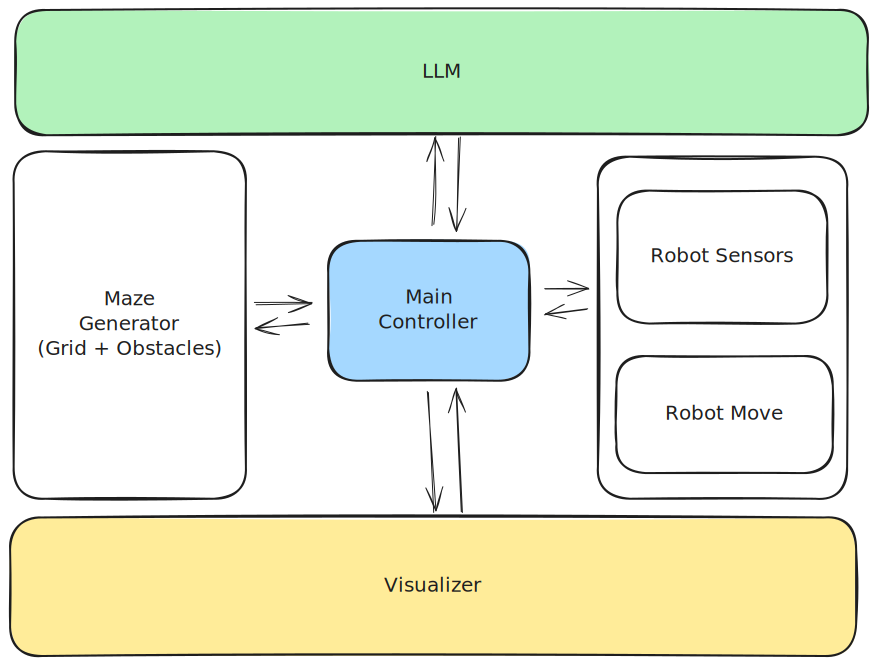

# MazeLLM
MazeLLM: Solving Mazes with Language Models

# Path Finding
<p align="center">
  <a href="https://excalidraw.com/#json=VrLbNlJTp0jjCZJ-t8U-3,yWYmD7WfJaijoeX5uEnBSg">
    
  </a>
</p>


# To run openai api calling demo
```bash
python src/openai_api_calling_demo.py

# or

python -m src.openai_api_calling_demo
```

# how to run the maze with random next steps (textual visualization)
```bash
python -m mazellm.main --n 4 --m 4
```

# how to run the maze with random next steps (typer visualization)
```bash
python -m mazellm.cli animate --n 8 "1,1" "1,2" "2,2" "3,2" "1,1" "1,2" "2,2" "3,2" "1,1" "1,2" "2,2" "3,2" "1,1" "1,2" "2,2" "3,2" "1,1" "1,2" "2,2" "3,2" "1,1" "1,2" "2,2" "3,2" --interval 0.5
```
