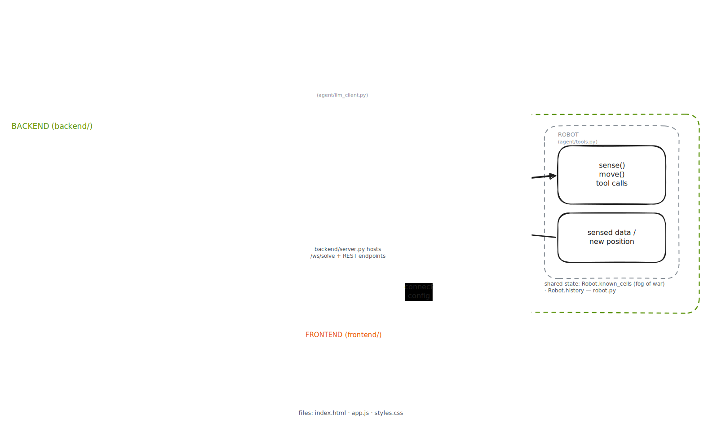

<p align="center">
  <a href="https://github.com/zozaai/MazeLLM/actions/workflows/ci.yml">
    
  </a>
  <a href="https://codecov.io/gh/zozaai/MazeLLM">
    
  </a>
</p>

<p align="center">
  <a href="docs/maze-llm-robot-hub-diagram.excalidraw">
    
  </a>
</p>

**MazeLLM** is an experimental project that explores maze solving with an
LLM tool-use agent, benchmarked against a classical **D\* Lite** solver that
runs under the *same* fog-of-war limitation (it only knows cells it has
sensed) — a fair, apples-to-apples comparison. It combines maze generation,
robot sensing/movement, and a live browser visualization of the solve
happening step by step.

---

## Architecture

- **`backend/maze/`** — maze representation, JSON load/save, random maze
  generation, robot state (position + fog-of-war memory of sensed cells).
- **`backend/agent/`** — the two solvers plus their shared plumbing.
  `llm_agent.py` is the LLM tool-use loop; `llm_client.py` wraps any
  OpenAI-compatible `chat.completions` endpoint, so the same code drives
  OpenAI's API, a local vLLM server, Ollama, or a Hugging Face model
  endpoint — only `.env` changes. `dstar_lite.py` is a **D\* Lite** solver
  that navigates under the identical fog-of-war (senses, plans over the known
  map treating unseen cells as open, and incrementally repairs the plan as it
  discovers walls). Both reuse the same `sense_surroundings`/`move` tools and
  memory rendering, so they emit identical step events — and the D\* Lite
  transcripts double as an expert source for finetuning the LLM.
- **`backend/server.py`** — FastAPI app. `POST /maze/generate` builds a
  random maze; `GET /llm/info` and `POST /llm/check` report and smoke-test
  the configured provider; `GET /health` is a liveness probe. The solve
  itself runs over the `/ws/solve` WebSocket (the client picks `"solver":
  "llm"` or `"dstar_lite"`): the server streams an `init` event, then per turn
  a `memory` event (what the solver knows that turn) followed by one
  `sense`/`move` event per action, and finally a `done` (or `error`) event.
- **`frontend/`** — vanilla HTML/CSS/JS. Renders the maze on a canvas,
  animates the robot's movement and fog-of-war reveal, shows a live decision
  log, and lets you pick the solver (LLM or D\* Lite) from a button group.
- **`mazes/`** — hand-authored demo maze JSON files.

## Setup

```bash
cp .env.example .env   # fill in LLM_BASE_URL / LLM_API_KEY / LLM_MODEL
pip install -e ".[dev]"
uvicorn backend.server:app --reload
```

Then open `frontend/index.html` in a browser (or serve it statically). It
talks to `http://localhost:8000` by default; point it elsewhere with
`?http=...&ws=...` query params. Pick a **Solver** (LLM or D\* Lite), then use
the **Generate** and **Solve** buttons to run a maze, or **Check connection**
to verify the LLM is reachable.

## Switching LLM providers

Set these in `.env` — no code changes needed:

| Provider          | LLM_BASE_URL                         | LLM_MODEL              |
|--------------------|---------------------------------------|-------------------------|
| OpenAI             | `https://api.openai.com/v1`           | `gpt-5.4-nano`          |
| Local vLLM         | `http://localhost:8000/v1`            | name of the served model|
| Local Ollama       | `http://localhost:11434/v1`           | e.g. `llama3.1`         |
| Hugging Face endpoint | your HF Inference Endpoint URL     | your model repo id      |

## D\* Lite solver (fog-of-war)

`backend/agent/dstar_lite.py` is the fair-comparison baseline: it solves the
maze under the **same** limitation as the LLM — it only knows cells it has
sensed. It plans a shortest route over the known map (treating unseen cells as
optimistically open), moves only through cells sensing has confirmed open, and
incrementally repairs the plan when it discovers a wall. Because it drives the
real robot through the same `sense_surroundings`/`move` tools, it's selectable
in the web UI and animates with the same fog reveal as the LLM. Its per-turn
`memory`/`sense`/`move` transcripts are in the LLM's exact format, so they can
be dumped as expert trajectories for supervised finetuning.

## Running tests

```bash
pytest             # excludes tests marked `integration` by default
pytest -m integration   # requires a real OPENAI_API_KEY / provider access
```

## Status

Working end-to-end: both solvers (LLM tool-use loop and D\* Lite) run over the
WebSocket under the same fog-of-war and are selectable in the live canvas
frontend (fog-of-war reveal, robot animation, decision log), covered by tests.
Next up: dumping D\* Lite expert trajectories as a finetuning dataset to teach
the LLM to solve mazes more reliably.
