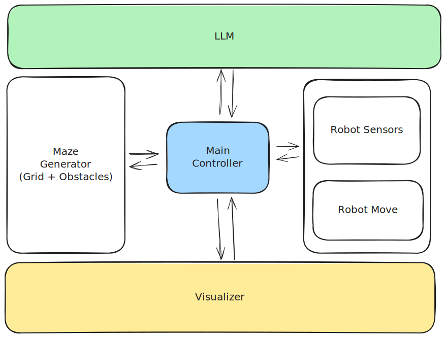

<p align="center">
  <a href="https://github.com/zozaai/MazeLLM/actions/workflows/ci.yml">
    
  </a>
  <a href="https://codecov.io/gh/zozaai/MazeLLM">
    
  </a>
</p>

<p align="center">
  <a href="docs/architecture-hub-diagram.excalidraw">
    
  </a>
</p>

**MazeLLM** is an experimental project that explores maze solving with an
LLM tool-use agent, benchmarked against classical pathfinding baselines
(BFS, DFS, A*). It combines maze generation, robot sensing/movement, and a
live browser visualization of the solve happening step by step.

---

## Architecture

- **`backend/maze/`** — maze representation, JSON load/save, random maze
  generation, robot state (position + fog-of-war memory of sensed cells).
- **`backend/agent/`** — the LLM tool-use loop. `llm_client.py` wraps any
  OpenAI-compatible `chat.completions` endpoint, so the same code drives
  OpenAI's API, a local vLLM server, Ollama, or a Hugging Face model
  endpoint — only `.env` changes.
- **`backend/baselines/`** — classical BFS/DFS/A* solvers, kept as a
  self-contained package (own maze/robot representation) to compute
  optimal/ground-truth path lengths for comparison against the LLM agent.
  This is what lets us actually measure whether fine-tuning improves
  maze-solving performance, rather than judging it qualitatively.
- **`backend/server.py`** — FastAPI app that runs the LLM agent loop and
  streams each step (`sensed`, `reasoning`/tool calls, `action`,
  `new_position`) to the browser over WebSocket.
- **`frontend/`** — vanilla HTML/CSS/JS. Renders the maze on a canvas,
  animates the robot's movement and fog-of-war reveal, and shows a live
  decision log next to the board.
- **`mazes/`** — hand-authored demo maze JSON files.

## Setup

```bash
cp .env.example .env   # fill in LLM_BASE_URL / LLM_API_KEY / LLM_MODEL
pip install -e ".[dev]"
uvicorn backend.server:app --reload
```

Then open `frontend/index.html` in a browser (or serve it statically) and
connect it to the running backend.

## Switching LLM providers

Set these in `.env` — no code changes needed:

| Provider          | LLM_BASE_URL                         | LLM_MODEL              |
|--------------------|---------------------------------------|-------------------------|
| OpenAI             | `https://api.openai.com/v1`           | `gpt-5.4-nano`          |
| Local vLLM         | `http://localhost:8000/v1`            | name of the served model|
| Local Ollama       | `http://localhost:11434/v1`           | e.g. `llama3.1`         |
| Hugging Face endpoint | your HF Inference Endpoint URL     | your model repo id      |

## Baseline solvers (BFS / DFS / A*)

`backend/baselines/` ports the original MazeLLM classical solvers. They
run against their own lightweight maze/robot representation and are meant
for computing a ground-truth comparison, not for driving the web UI:

```python
from backend.baselines import BFSSolver
from backend.baselines.maze import Maze
from backend.baselines.robot import Robot
from backend.baselines.types import Position

maze = Maze(cols=10, rows=10, seed=42)
maze.generate_maze()
start = maze.find_cell("S")
robot = Robot(maze=maze, position=Position(x=start.x, y=start.y))

solver = BFSSolver()
# await solver.next(maze=maze, robot=robot) repeatedly until StepResult.done
```

## Running tests

```bash
pytest             # excludes tests marked `integration` by default
pytest -m integration   # requires a real OPENAI_API_KEY / provider access
```

## Status

Working end-to-end: the LLM tool-use loop, WebSocket streaming, and the
live canvas frontend (fog-of-war reveal, robot animation, decision log)
are implemented and covered by tests, alongside BFS/DFS/A* baselines for
comparison. Not yet wired up: exposing the baseline solvers through the
web UI/WebSocket so a solve can be run side-by-side with the LLM agent —
today they're only available as a Python API.
